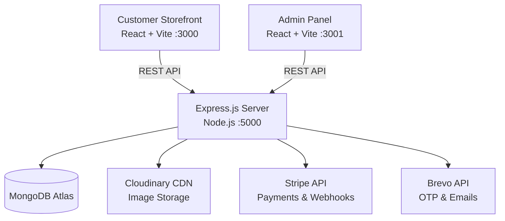

# ⚡ Alpha PC Shop - Full-Stack E-Commerce Platform

[](https://nodejs.org/)
[](https://expressjs.com/)
[](https://react.dev/)
[](https://www.mongodb.com/)
[](https://tailwindcss.com/)
[](https://opensource.org/licenses/ISC)

> **A complete, production-ready MERN stack e-commerce platform** tailored for selling Gaming PCs, Laptops, and Hardware Components in Ethiopia (with ETB currency support). Featuring a high-performance customer storefront, comprehensive admin dashboard, secure Stripe payments, Brevo transactional emails, and Cloudinary media management.

---

## 📑 Table of Contents

- [Overview](#-overview)
- [Architecture & Tech Stack](#-architecture--tech-stack)
- [Key Features](#-key-features)
  - [Customer Storefront](#customer-storefront)
  - [Admin Dashboard](#admin-dashboard)
- [Project Structure](#-project-structure)
- [Quick Start Guide](#-quick-start-guide)
  - [Prerequisites](#prerequisites)
  - [1. Clone Repository](#1-clone-repository)
  - [2. Backend Configuration](#2-backend-configuration)
  - [3. Customer Frontend Configuration](#3-customer-frontend-configuration)
  - [4. Admin Frontend Configuration](#4-admin-frontend-configuration)
- [Running Locally](#-running-locally)
- [Environment Variables Reference](#-environment-variables-reference)
- [API Endpoints Documentation](#-api-endpoints-documentation)
- [User Roles & Permissions](#-user-roles--permissions)
- [Deployment Guide](#-deployment-guide)
  - [Render Deployment Blueprint](#render-deployment-blueprint)
- [Security Features](#-security-features)
- [Contributing & License](#-contributing--license)

---

## 🌐 Overview

Alpha PC Shop is engineered to deliver a seamless e-commerce experience for both gamers/buyers and store administrators.

- **Customer Storefront**: Fast catalog browsing, advanced filtering (specs, price, brand), responsive cart, ETB Stripe checkout, live order tracking, and profile management.
- **Admin Dashboard**: Real-time business analytics, interactive revenue/sales charts, catalog CRUD with multi-image Cloudinary upload, stock management, and granular user role management.
- **Backend API**: Secure RESTful API built on Express & Mongoose with JWT authentication, OTP email verification, Helmet protection, rate limiting, and Stripe webhook handling.

---

## 🛠 Architecture & Tech Stack



| Layer | Technologies |
|---|---|
| **Backend** | Node.js, Express.js, MongoDB (Mongoose), JWT, Bcrypt, Multer, Helmet, Express Rate Limit |
| **Customer Frontend** | React 18, Vite, React Router v6, Tailwind CSS, Lucide Icons, Axios, Stripe.js, React Hot Toast |
| **Admin Frontend** | React 18, Vite, React Router v6, Tailwind CSS, Lucide Icons, Recharts (Analytics), Axios, React Hot Toast |
| **Integrations** | Stripe (Payments), Cloudinary (Image CDN), Brevo (Transactional Email & OTP) |

---

## ✨ Key Features

### Customer Storefront
- 🔍 **Interactive Catalog**: Browse Gaming PCs, Laptops, and components with real-time search, category filters, and sorting.
- 📦 **Rich Product Details**: Image galleries, full spec sheets, warranty information, and customer reviews.
- 🛒 **Persistent Shopping Cart**: Real-time price calculation, stock validation, and quantity adjustments.
- 💳 **Secure Checkout**: Integrated Stripe payments supporting ETB currency.
- 🚚 **Order Tracking**: Detailed timeline for order placement, processing, shipping, and delivery.
- 🔐 **Account Security**: JWT-based auth, OTP email verification via Brevo, and password reset flows.

### Admin Dashboard
- 📊 **Executive Overview**: High-level KPI cards for total revenue, active orders, customer growth, and inventory alerts.
- 📈 **Visual Analytics**: Interactive charts using Recharts for daily/monthly sales volume, top-selling products, and user acquisition.
- 🏷️ **Product Catalog Manager**: Multi-image upload to Cloudinary, rich description editor, variant specs, and pricing controls.
- 📋 **Order Fulfillment**: Update order status (`Pending`, `Processing`, `Shipped`, `Delivered`, `Cancelled`) and attach shipping carrier tracking IDs.
- 👥 **Role & User Management**: Inspect registered users and elevate roles (`user`, `admin`, `super_admin`).
- ⚠️ **Inventory Alerts**: Low-stock warnings and real-time inventory count modifications.

---

## 📂 Project Structure

```
alpha-pc-shop/
├── backend/                  # RESTful API Server (Port 5000)
│   ├── controllers/          # Business logic handlers
│   ├── middleware/           # Auth, role check, upload & error middlewares
│   ├── models/               # Mongoose schemas (User, Product, Order, Cart)
│   ├── routes/               # API route definitions
│   ├── utils/                # Integrations (Brevo, Cloudinary, Stripe)
│   ├── uploads/              # Local temporary upload directory
│   ├── server.js             # Application entry point
│   ├── package.json
│   └── .env.example          # Backend environment template
│
├── customer-frontend/        # Client Storefront SPA (Port 3000)
│   ├── src/
│   │   ├── components/       # Navbar, Footer, ProductCard, CartModal, etc.
│   │   ├── context/          # Auth & Cart React Contexts
│   │   ├── pages/            # Home, Products, ProductDetails, Checkout, Orders, Profile
│   │   ├── utils/            # Axios API client & helpers
│   │   ├── App.jsx           # App routes
│   │   └── main.jsx          # Vite entrypoint
│   ├── package.json
│   └── .env.example
│
├── admin-frontend/           # Management Portal SPA (Port 3001)
│   ├── src/
│   │   ├── components/       # Admin Sidebar, Header, StatCards, Tables
│   │   ├── context/          # Admin Auth Context
│   │   ├── pages/            # Dashboard, Products, Orders, Users, Inventory, Analytics
│   │   ├── utils/            # Axios API client & helpers
│   │   ├── App.jsx           # Admin routes & guards
│   │   └── main.jsx          # Vite entrypoint
│   ├── package.json
│   └── .env.example
│
├── .gitignore                # Global ignore rules
├── render.yaml               # Infrastructure-as-code for Render deployment
└── README.md                 # Project documentation
```

---

## 🚀 Quick Start Guide

### Prerequisites
- [Node.js](https://nodejs.org/) (v18.0 or higher)
- [MongoDB Atlas](https://www.mongodb.com/atlas) cluster URL
- [Cloudinary](https://cloudinary.com/) credentials for image storage
- [Stripe](https://stripe.com/) developer account for API keys
- [Brevo](https://www.brevo.com/) account for email/OTP delivery

---

### 1. Clone Repository

```bash
git clone https://github.com/mulugeta24/alpha-pc-shop.git
cd alpha-pc-shop
```

---

### 2. Backend Configuration

```bash
cd backend
npm install
```

Create a `.env` file inside `backend/` (or copy from `.env.example`):

```env
PORT=5000
NODE_ENV=development

# Database
MONGODB_URI=mongodb+srv://<username>:<password>@cluster.mongodb.net/alpha-pc-shop

# Auth
JWT_SECRET=your_super_secret_jwt_key_here
JWT_EXPIRE=7d

# Cloudinary
CLOUDINARY_CLOUD_NAME=your_cloud_name
CLOUDINARY_API_KEY=your_api_key
CLOUDINARY_API_SECRET=your_api_secret

# Stripe
STRIPE_SECRET_KEY=sk_test_your_secret_key
STRIPE_PUBLISHABLE_KEY=pk_test_your_publishable_key
STRIPE_WEBHOOK_SECRET=whsec_your_webhook_secret

# Brevo (Email)
BREVO_API_KEY=xkeysib-your_brevo_api_key
BREVO_SENDER_EMAIL=noreply@yourdomain.com
BREVO_SENDER_NAME=Alpha PC Shop

# URLs
CUSTOMER_FRONTEND_URL=http://localhost:3000
ADMIN_FRONTEND_URL=http://localhost:3001

# Shipping
SHIPPING_API_KEY=your_shipping_key
BASE_SHIPPING_RATE=150
FREE_SHIPPING_THRESHOLD=15000
```

---

### 3. Customer Frontend Configuration

```bash
cd ../customer-frontend
npm install
```

Create a `.env` file inside `customer-frontend/`:

```env
VITE_API_URL=http://localhost:5000/api
VITE_STRIPE_PUBLISHABLE_KEY=pk_test_your_publishable_key
```

---

### 4. Admin Frontend Configuration

```bash
cd ../admin-frontend
npm install
```

Create a `.env` file inside `admin-frontend/`:

```env
VITE_API_URL=http://localhost:5000/api
```

---

## 💻 Running Locally

You can run each service concurrently in separate terminals:

```bash
# Terminal 1: Backend API
cd backend
npm run dev
# Running on http://localhost:5000

# Terminal 2: Customer Storefront
cd customer-frontend
npm run dev
# Running on http://localhost:3000

# Terminal 3: Admin Dashboard
cd admin-frontend
npm run dev
# Running on http://localhost:3001
```

---

## 🔑 Initial Setup & Super Admin Access

1. Open `http://localhost:3000` and register a new user account.
2. Complete email verification using the OTP sent to your email.
3. Access your MongoDB database (via MongoDB Atlas dashboard or Compass):
   - Find the registered document in the `users` collection.
   - Change `"role": "user"` to `"role": "super_admin"`.
4. Navigate to `http://localhost:3001` and log in with your credentials to access the Admin Panel.

---

## 📡 API Endpoints Reference

### Authentication (`/api/auth`)
| Method | Endpoint | Description | Access |
|---|---|---|---|
| `POST` | `/api/auth/register` | Register new user & send OTP | Public |
| `POST` | `/api/auth/verify-otp` | Verify email with OTP | Public |
| `POST` | `/api/auth/login` | Authenticate user & get JWT | Public |
| `POST` | `/api/auth/forgot-password` | Send password reset token email | Public |
| `PUT` | `/api/auth/reset-password/:token` | Reset password using token | Public |
| `GET` | `/api/auth/me` | Fetch authenticated user details | Private |

### Products (`/api/products`)
| Method | Endpoint | Description | Access |
|---|---|---|---|
| `GET` | `/api/products` | Query products (filtering, search, pagination) | Public |
| `GET` | `/api/products/:id` | Get single product specifications | Public |
| `POST` | `/api/products` | Create product with image uploads | Admin |
| `PUT` | `/api/products/:id` | Update product details | Admin |
| `DELETE` | `/api/products/:id` | Remove product & clean CDN assets | Admin |

### Cart & Orders (`/api/cart`, `/api/orders`)
| Method | Endpoint | Description | Access |
|---|---|---|---|
| `GET` | `/api/cart` | Get current user's cart | Authenticated |
| `POST` | `/api/cart` | Add / increment product in cart | Authenticated |
| `PUT` | `/api/cart/:productId` | Update item quantity in cart | Authenticated |
| `DELETE` | `/api/cart/:productId` | Delete item from cart | Authenticated |
| `POST` | `/api/orders` | Create new order | Authenticated |
| `POST` | `/api/orders/:id/payment` | Confirm order payment intent | Authenticated |
| `GET` | `/api/orders/my-orders` | List logged-in user's orders | Authenticated |
| `GET` | `/api/orders` | List all customer orders | Admin |
| `PUT` | `/api/orders/:id/status` | Update fulfillment state & tracking | Admin |

### Admin & Analytics (`/api/admin`, `/api/analytics`)
| Method | Endpoint | Description | Access |
|---|---|---|---|
| `GET` | `/api/admin/dashboard` | Aggregated dashboard KPI numbers | Admin |
| `GET` | `/api/admin/inventory` | Inventory tracking & low stock lists | Admin |
| `PUT` | `/api/admin/products/:id/stock`| Directly update stock levels | Admin |
| `GET` | `/api/analytics/sales` | Sales metrics & revenue over time | Admin |
| `GET` | `/api/analytics/products` | Top selling products metrics | Admin |
| `GET` | `/api/analytics/users` | User growth and acquisition data | Admin |

---

## 🛡️ User Roles & Permissions

```
┌──────────────┐
│ super_admin  │  ► Full system access, manage admins, delete data, modify roles
└──────┬───────┘
       │
┌──────▼───────┐
│    admin     │  ► Product CRUD, view orders, update fulfillment, view analytics
└──────┬───────┘
       │
┌──────▼───────┐
│     user     │  ► Browse catalog, manage personal cart/orders, profile settings
└──────────────┘
```

---

## ☁️ Deployment Guide

This project includes a ready-to-use [`render.yaml`](file:///render.yaml) Blueprint to deploy all 3 services automatically on [Render](https://render.com/).

### Deploy with Render Blueprint:
1. Push your repository to GitHub: `https://github.com/mulugeta24/alpha-pc-shop`
2. Log into [Render Dashboard](https://dashboard.render.com/).
3. Click **New +** → **Blueprint**.
4. Connect your GitHub repository `alpha-pc-shop`.
5. Render will automatically detect `render.yaml` and configure:
   - `alpha-pc-shop-backend` (Node Web Service)
   - `alpha-pc-shop` (Customer Frontend Node/SPA Service)
   - `alpha-pc-shop-admin` (Admin Frontend Static Site)
6. Fill in the required environment variables in the Render dashboard:
   - `MONGODB_URI`, `JWT_SECRET`, `STRIPE_SECRET_KEY`, `CLOUDINARY_*`, `BREVO_*`
7. Click **Apply** to launch your live production environment!

---

## 🔒 Security Practices

- **Password Hashing**: Salted bcrypt password hashing before database storage.
- **JWT Authentication**: Stateles tokens with configured expiry time and Bearer header validation.
- **Data Protection**: CORS origin restrictions, XSS protection, and HTTP header security via Helmet.js.
- **Abuse Prevention**: Rate limiting middleware to prevent brute force and DDoS attacks.
- **Safe Media Management**: Cloudinary API signatures and automatic file sanitation on upload.

---

## 📄 License

This project is licensed under the [ISC License](file:///LICENSE).

---

## 👨‍💻 Author & Support

Developed by **[Mulugeta](https://github.com/mulugeta24)**.  
For questions, support, or bug reports, please feel free to open an issue on GitHub or reach out via email at `info@alphapcshop.com`.
